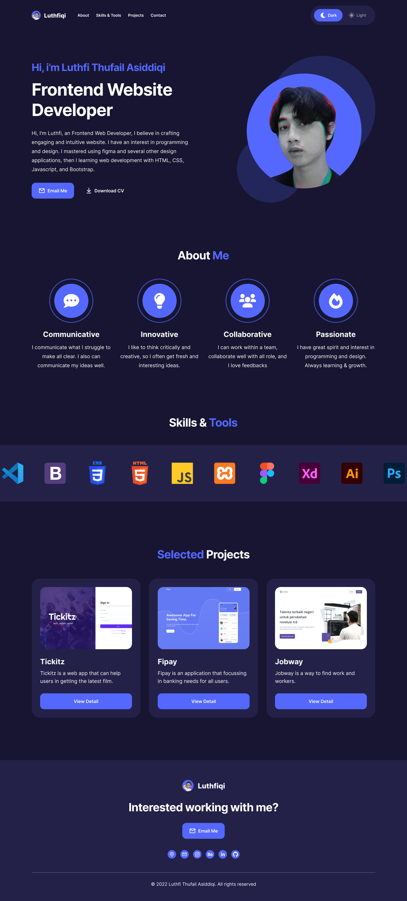
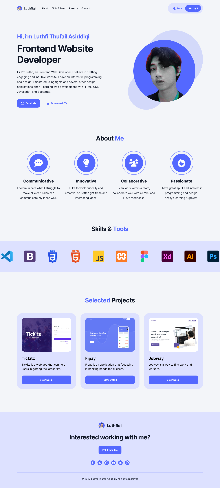

<div style="display:flex; align-items: center;">

<h1 >Luthfiqi - Personal Website</h1>
</div>

<h4 >Hi, I'm Luthfi, an Frontend Web Developer, I believe in crafting engaging and intuitive website. I have an interest in programming and design. I mastered using figma and several other design applications, then I learning web development with HTML, CSS, Javascript, and Bootstrap.</h4>

### Link Preview Website : [https://luthfidiqi.github.io]

<hr>

<br>

## **Contents**

- [**Requirement**](#requirement)

- [**Installation**](#installation)

- [**Demo**](#demo)

- [**License**](#license)

<br>

## **Requirement**

- Node.js
- Vite Bootstrap
- HTML, CCS, JS

<br>

## **Installation**

- Clone Repositories

```
https://github.com/luthfidiqi/luthfidiqi.github.io
```

- Open Project Folder

```
$ cd luthfidiqi.github.io-master
```

- Intall NPM Package

```
npm install
```

- Start The Project

```
npm start
```

<br>

## **Demo**

### Link Preview Website : [https://luthfidiqi.github.io]

<hr>

<div display="flex">

<div>

### Dark Mode


<br>
</div>

<div>

### Light Mode


<br>
</div>

</div>

<hr>

<br>

## **License**

© [Luthfi Thufail Asiddiqi](https://github.com/luthfidiqi/)
